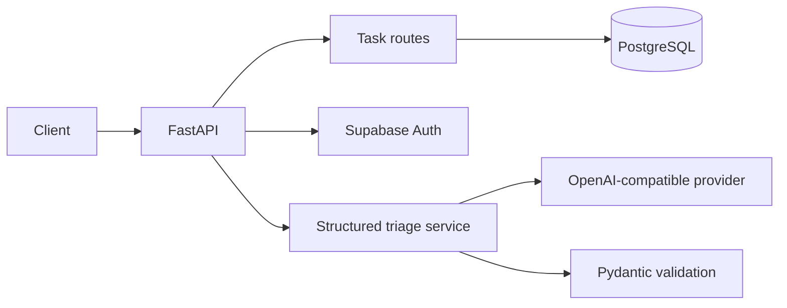

# Task API

A tested FastAPI backend that combines PostgreSQL task CRUD, Supabase authentication, and structured LLM support-message triage. The repository documents a staged backend-learning path while keeping each production concern explicit: persistence, authentication, schema validation, retries, evaluation, and Dockerized delivery.

> **Status:** Portfolio and training project. The core API is implemented and tested; provider-backed authentication and LLM calls require your own credentials.

## Problem and solution

The project starts with a small task API and extends it into a realistic backend integration exercise. PostgreSQL provides durable storage, Supabase verifies users without storing passwords in the API, and `/triage` turns an unstructured support message into a validated routing decision instead of free-form model text.

## Core capabilities

- Task CRUD with PostgreSQL persistence and parameterized SQL.
- Stable validation and JSON error responses.
- Supabase signup, login, logout, profile, and protected dashboard routes.
- Provider-neutral OpenAI-compatible LLM client.
- Pydantic-validated triage output with one bounded repair attempt.
- Explicit timeout and retry rules for `429`, `5xx`, and network failures.
- Deterministic stub mode for local development and CI.
- Prompt versioning, evaluation cases, quarantine logging, and cost logs.
- Docker Compose stack with PostgreSQL health checks and a named volume.

## Architecture



## Main API surface

| Method | Route | Purpose |
| --- | --- | --- |
| `GET` | `/health` | Service health |
| `GET/POST` | `/tasks` | List or create tasks |
| `GET/PUT/DELETE` | `/tasks/{task_id}` | Read, update, or delete one task |
| `POST` | `/auth/signup` | Create a Supabase user |
| `POST` | `/auth/login` | Obtain a verified session |
| `POST` | `/auth/logout` | End the current session |
| `GET` | `/protected/profile` | Read the verified user profile |
| `GET` | `/protected/dashboard` | Example protected endpoint |
| `POST` | `/triage` | Return a structured support-routing decision |

Interactive OpenAPI documentation is available at `/docs` while the API is running.

## Technology stack

- Python 3.10+, FastAPI, Uvicorn, Pydantic
- PostgreSQL and psycopg 3
- Supabase Auth
- HTTPX for provider calls
- Docker and Docker Compose
- pytest and FastAPI TestClient

## Quick start

Requirements: Docker Desktop with Compose.

```bash
git clone https://github.com/Ahmad-Joker/task-api.git
cd task-api
cp .env.example .env
docker compose up --build
```

Windows PowerShell:

```powershell
Copy-Item .env.example .env
docker compose up --build
```

Open:

- API: [http://localhost:8000](http://localhost:8000)
- Swagger UI: [http://localhost:8000/docs](http://localhost:8000/docs)

Stub mode is enabled by default, so `/triage` returns a valid deterministic fallback without making a provider call.

## Configuration

| Variable | Purpose |
| --- | --- |
| `DATABASE_URL` | PostgreSQL connection used by the API |
| `TEST_DATABASE_URL` | Isolated PostgreSQL database for CRUD tests |
| `SUPABASE_URL` | Supabase project URL |
| `SUPABASE_KEY` | Supabase anon/public key; never use `service_role` here |
| `LLM_BASE_URL` | OpenAI-compatible provider base URL |
| `LLM_API_KEY` | Provider API key |
| `LLM_MODEL` | Provider model identifier |
| `LLM_STUB` | `1` enables deterministic no-network responses |
| `LLM_ENABLED` | Disables the integration when set to `false` |

Real `.env` files, tokens, logs, and local database files are ignored by Git.

## Testing

Create a virtual environment and install dependencies:

```powershell
python -m venv .venv
.\.venv\Scripts\python -m pip install -r requirements.txt
```

Run the authentication and LLM tests without external services:

```powershell
.\.venv\Scripts\python -m pytest -q tests\test_auth.py tests\test_triage.py
```

Run the PostgreSQL CRUD suite after starting the database and loading `.env`:

```powershell
docker compose up -d db
.\.venv\Scripts\python -m pytest -q tests\test_api.py
```

The root repository also contains separate training modules with their own dependencies and test commands. Run those from their directories instead of using an unscoped root-level `pytest` command:

- `background-job/`
- `scraper/`
- `pdf-report-generator/`
- `visual-ai-workflow-system/`

## Structured triage contract

Input:

```json
{ "text": "I cannot log in after resetting my password." }
```

Output fields are constrained to `category`, `urgency`, `suggested_team`, `confidence`, and `reason`. Invalid model output is repaired once, then rejected and quarantined rather than returned as trusted data. Prompt version `triage-v1` lives in `prompts/triage-v1.md`; evaluation cases and results live in `evals/`.

## Security and reliability choices

- Passwords remain with Supabase; the API does not store or hash them.
- Bearer tokens are verified through Supabase rather than trusted after decoding.
- SQL statements use parameterized placeholders.
- LLM output is schema-validated before reaching clients.
- Retryable and non-retryable provider failures are handled separately.
- Secrets and generated logs are excluded from version control.

## Limitations

- Task routes are intentionally public in this training version; auth-protected task ownership is not implemented.
- Stub-mode evaluation proves the harness and response shape, not real-model accuracy.
- The in-repository modules are independent exercises, not one deployed monolith.
- A production deployment should add migrations, centralized observability, rate limiting, and stronger authorization.
