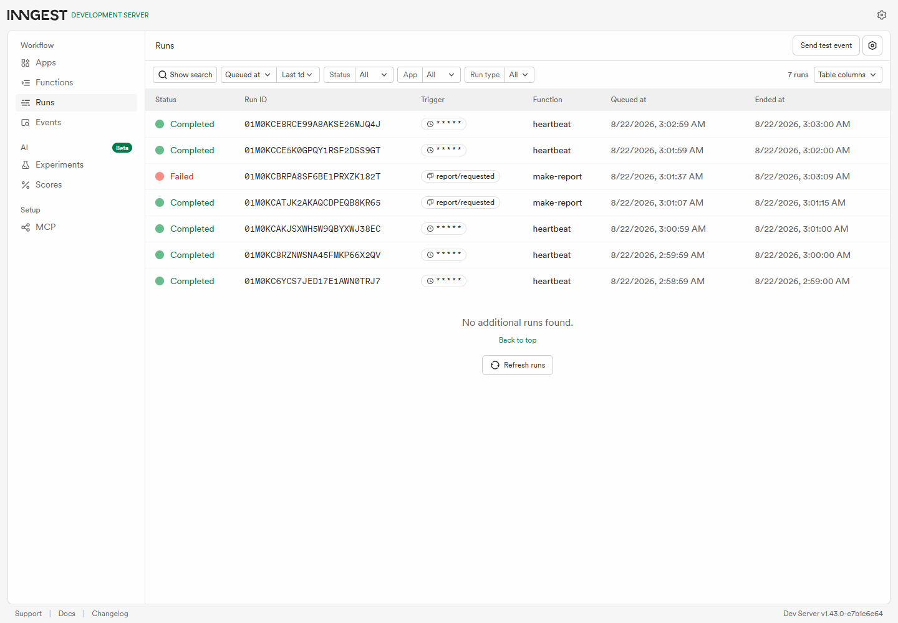

# Background Job API

A small Week 6 Express API where slow report generation runs through Inngest instead of inside the HTTP request. `POST /reports` answers immediately with `202 Accepted`, Inngest builds the report in the background, and the client polls a status endpoint until the report is done.

## Run

Install dependencies:

```powershell
npm install
```

Terminal 1: start the API.

```powershell
npm run dev
```

Terminal 2: start the Inngest Dev Server.

```powershell
npm run inngest:dev
```

Open the dashboard at `http://localhost:8288`.

If port `3000` is already busy, use the alternate local commands:

```powershell
npm run dev:3100
npm run inngest:dev:3100
```

## Endpoints

| Method | Path | Purpose |
| --- | --- | --- |
| `GET` | `/health` | Confirms the API is running. |
| `POST` | `/reports` | Accepts `{ "topic": "cats" }`, stores a pending report, sends `report/requested`, and returns `202` with the id. |
| `GET` | `/reports/:id` | Returns the report status: first `pending`, later `done` with `result`, or `failed` if the background job failed. Unknown ids return `404`. |

## Inngest Functions

| Function | Trigger | Purpose |
| --- | --- | --- |
| `say-hello` | Event `test/hello` | Sleeps for 5 seconds and returns a hello message. |
| `make-report` | Event `report/requested` | Sleeps for 8 seconds, then builds the report in a durable `build-report` step. It retries twice for 3 total attempts. |
| `heartbeat` | Cron `* * * * *` | Runs every minute and logs report counts for `pending`, `done`, and `failed`. |

## Proof

Health check:

```powershell
Invoke-RestMethod http://localhost:3100/health
```

Output:

```json
{"status":"ok"}
```

Fast report request and polling:

```powershell
$created = Invoke-RestMethod `
  -Uri "http://localhost:3100/reports" `
  -Method Post `
  -ContentType "application/json" `
  -Body '{"topic":"cats"}'

Invoke-RestMethod "http://localhost:3100/reports/$($created.id)"
Start-Sleep -Seconds 20
Invoke-RestMethod "http://localhost:3100/reports/$($created.id)"
```

Output from my run:

```text
POST_MS=96
{"id":"d8c58383-921c-48bd-b3c5-ee1e0b6b9523","status":"pending"}
{"id":"d8c58383-921c-48bd-b3c5-ee1e0b6b9523","topic":"cats","status":"pending","createdAt":"2026-08-22T00:01:07.069Z","updatedAt":"2026-08-22T00:01:07.069Z"}
{"id":"d8c58383-921c-48bd-b3c5-ee1e0b6b9523","topic":"cats","status":"done","createdAt":"2026-08-22T00:01:07.069Z","updatedAt":"2026-08-22T00:01:15.313Z","result":"Report for \"cats\": background work completed successfully."}
```

Bad input:

```powershell
Invoke-WebRequest `
  -Uri "http://localhost:3100/reports" `
  -Method Post `
  -ContentType "application/json" `
  -Body "{}"
```

Output:

```text
400
{"error":"topic is required"}
```

Failed job:

```powershell
$failed = Invoke-RestMethod `
  -Uri "http://localhost:3100/reports" `
  -Method Post `
  -ContentType "application/json" `
  -Body '{"topic":"fail"}'

Start-Sleep -Seconds 20
Invoke-RestMethod "http://localhost:3100/reports/$($failed.id)"
```

Output:

```json
{"id":"c6b1bed9-b0b3-4fa4-b6f7-0187c47ce44e","topic":"fail","status":"failed","createdAt":"2026-08-22T00:01:37.976Z","updatedAt":"2026-08-22T00:01:46.142Z","error":"The report oven is broken!"}
```

## Dashboard

The dashboard screenshot shows completed heartbeat cron runs, a completed `make-report`, and a failed `make-report` run.



## Stage Sentences

Stage 3: missing topic is a bad request and should not be retried; `topic: "fail"` is accepted work that fails later, so the background worker retries it automatically.

Stage 4: `0 8 * * *` runs every day at 08:00.

Stage 4: `0 22 * * 0` runs every Sunday at 22:00.

## Tests

```powershell
npm test
```
