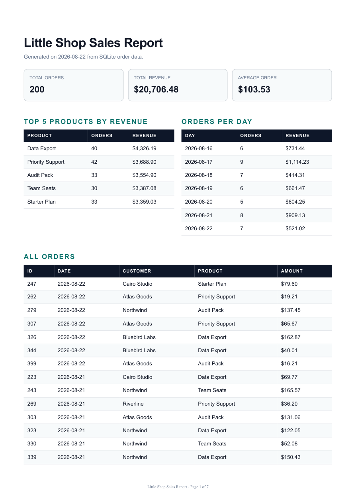

# PDF Report Generator

This is a small FastAPI report pipeline for the little-shop dataset. It creates 200 SQLite order rows, aggregates them with SQL, renders an HTML report with Playwright, stores the PDF on disk, and returns links so clients download the file separately from the JSON API.

```text
query -> render HTML -> print PDF -> store file -> serve by link
```

## Dataset

I chose Option A: little shop orders.

The seed script creates `report.db` with:

- `orders`: `id`, `customer`, `product`, `amount`, `created_at`
- 200 deterministic fake orders
- 6 customers
- 6 products
- dates across the last 30 days

The seed script starts with `DELETE FROM orders`, so running it twice still leaves exactly 200 rows.

## Setup

From this folder:

```powershell
..\.venv\Scripts\python.exe -m pip install -r requirements.txt
..\.venv\Scripts\python.exe -m playwright install chromium
```

Seed the database:

```powershell
..\.venv\Scripts\python.exe scripts\seed.py
```

Run the API:

```powershell
..\.venv\Scripts\uvicorn app:app --reload --port 8001
```

Run tests:

```powershell
..\.venv\Scripts\python.exe -m pytest tests
```

Health check:

```powershell
curl -i http://localhost:8001/health
```

## Report Commands

Print the aggregation object:

```powershell
..\.venv\Scripts\python.exe scripts\print_report_data.py
```

Render a test PDF:

```powershell
..\.venv\Scripts\python.exe scripts\render_test_pdf.py
```

Generate a stored report through the API:

```powershell
curl -i -X POST http://localhost:8001/reports
```

Download the generated PDF:

```powershell
curl -o my-report.pdf http://localhost:8001/reports/1/file
```

Force a fresh report:

```powershell
curl -i -X POST http://localhost:8001/reports -H "Content-Type: application/json" -d "{\"force\":true}"
```

## API

| Method | Route | Purpose |
| --- | --- | --- |
| `GET` | `/health` | Health check |
| `POST` | `/reports` | Generate today's report or return the existing one |
| `GET` | `/reports/{id}` | Return report metadata and file link |
| `GET` | `/reports/{id}/file` | Download the PDF file |

Unknown report ids return:

```json
{
  "error": "Report not found"
}
```

## Aggregation SQL

Totals:

```sql
SELECT
  COUNT(*) AS total_orders,
  ROUND(SUM(amount), 2) AS total_revenue,
  ROUND(AVG(amount), 2) AS average_order_value
FROM orders
```

Top 5 products by revenue:

```sql
SELECT
  product,
  COUNT(*) AS order_count,
  ROUND(SUM(amount), 2) AS revenue
FROM orders
GROUP BY product
ORDER BY revenue DESC
LIMIT 5
```

Orders per day for the last 7 seeded days:

```sql
SELECT
  created_at AS day,
  COUNT(*) AS order_count,
  ROUND(SUM(amount), 2) AS revenue
FROM orders
WHERE created_at >= date((SELECT MAX(created_at) FROM orders), '-6 days')
GROUP BY created_at
ORDER BY created_at ASC
```

Long table:

```sql
SELECT id, customer, product, amount, created_at
FROM orders
ORDER BY created_at DESC, id ASC
```

## Proof

Seed proof:

```text
orders=200
orders=200
SELECT COUNT(*) FROM orders -> 200
```

Aggregation proof:

```text
total_orders=200
total_revenue=20706.48
average_order_value=103.53
top_products=5
orders_per_day=7
orders=200
```

PDF proof:

```text
reports/test.pdf
page_count=7
```

API proof:

```text
POST /reports -> 201
GET /reports/1 -> 200
GET /reports/999999 -> 404
GET /reports/1/file -> 200 application/pdf, starts with %PDF
```

Idempotency proof from the current database:

```text
POST /reports -> 200 id=2
POST /reports -> 200 id=2
POST /reports {"force": true} -> 201 id=3
```

If the database is fresh, the first normal POST returns `201`, the second normal POST returns `200` with the same id, and `force` returns a new `201`.

## PDF Screenshot

Page 1 of the generated PDF:



## Stage 4 Note

I would move this work out of the request when reports take more than a few seconds, when the table grows into thousands of rows, or when many users can click generate at once. At that point, a background job would make the user experience safer because the request could return quickly while the PDF renders elsewhere.

## Stage 5 Note

The once-per-day check protects against double-clicks and retries creating duplicate files. A real-world example where missing idempotency costs money is emailing or charging a customer twice because the user clicked the same button twice.

## Git-Ignored Artifacts

Generated artifacts are intentionally not committed:

```text
report.db
reports/
```

The seed script and renderer are the committed recipe for reproducing them.
